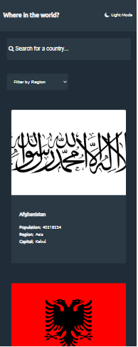
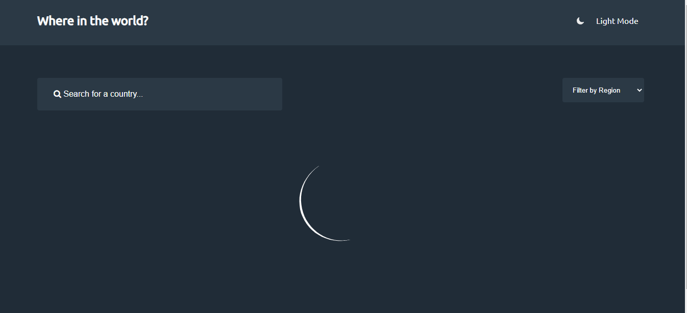
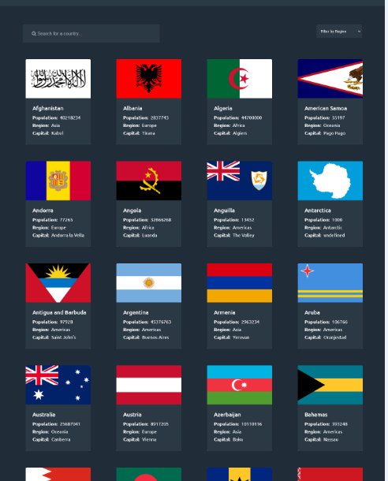
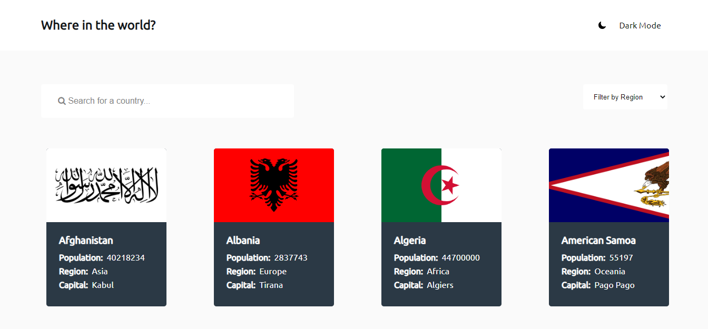
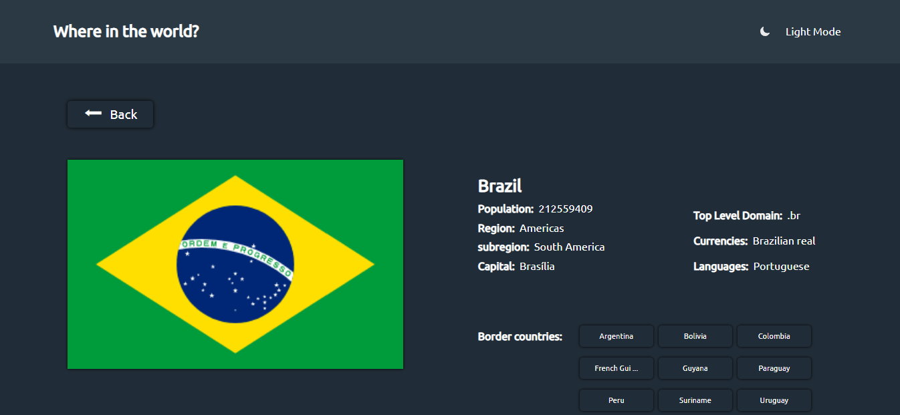
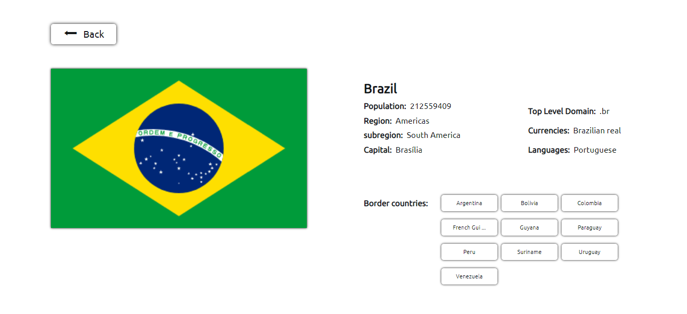
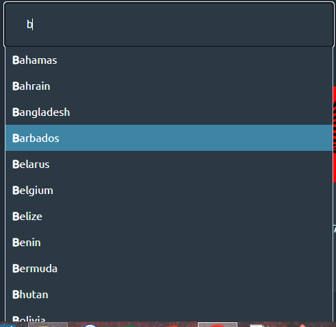
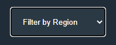

# Frontend Mentor - REST Countries API with color theme switcher solution

This is a solution to the [REST Countries API with color theme switcher challenge on Frontend Mentor](https://www.frontendmentor.io/challenges/rest-countries-api-with-color-theme-switcher-5cacc469fec04111f7b848ca). Frontend Mentor challenges help you improve your coding skills by building realistic projects.

## Table of contents

- [Overview](#overview)
  - [The challenge](#the-challenge)
  - [Screenshot](#screenshot)
  - [Links](#links)
- [My process](#my-process)
  - [Built with](#built-with)
  - [What I learned](#what-i-learned)
  - [Continued development](#continued-development)
  - [Useful resources](#useful-resources)
- [Author](#author)
- [Acknowledgments](#acknowledgments)

**Note: Delete this note and update the table of contents based on what sections you keep.**

## Overview

### The challenge

Users should be able to:

- See all countries from the API on the homepage
- Search for a country using an `input` field
- Filter countries by region
- Click on a country to see more detailed information on a separate page
- Click through to the border countries on the detail page
- Toggle the color scheme between light and dark mode _(optional)_

### Screenshot

</br>

#### Mobile

</br>
<p align="center">
    
     <figcaption>Fig.1 - Web page on a mobile.</figcaption>
</p>
</br>
<p align="center">
    
    <figcaption>Fig.2 - Clicked deteiled country. </figcaption>
</p>
</br>
<hr>
</br>

#### Desktop

</br>
<p align="center" >
    
     <figcaption>Fig.3 - Loading gif while page is fetching data.</figcaption>
</p>
</br>
<p align="center">
    
     <figcaption>Fig.4 - Web page on a Desktop.</figcaption>
</p>
</br>
<p align="center">
    
    <figcaption>Fig.5 -Light mode on a desktop.</figcaption>
</p>
</br>
<p align="center">
    
    <figcaption>Fig.7 - Clicked deteiled country on a desktop. </figcaption>
</p>
</br>
<p align="center">
    
    <figcaption>Fig.7 - Clicked deteiled country on a desktop light mode. </figcaption>
</p>
</br>
<p align="center">
    
    <figcaption>Fig.8 - Auto Complete on the Search field. </figcaption>
</p>
</br>
<p align="center">
    
    
    
    <figcaption>Fig.9 - When a user clicks on [ Where in the world? ], an event will be triggered, and the field [ Filter by Region ] will flash to alert the user of the region options. </figcaption>
</p>

### Links

- Solution URL: [Solution Frontend Mentor](https://www.frontendmentor.io/solutions/mobile-first-aproach-T2VjFPEejD)
- Live Site URL: [live site](https://thiagoando.github.io/rest-countries-api-with-color-theme-switcher-master/)

## My process

### Built with

- Semantic HTML5 markup
- CSS Grid
- Mobile-first workflow
- Java Script Modules

### What I learned

<div style="text-align: justify">
Building front-end web pages is such an enjoyable task to accomplish. Getting a layout of a website made by a web designer and working towards making it functional and running on the browser is challenging and exciting. However, most online applications with a User Interface are built to create a bridge between the user and the server that stores and sends data. This challenge from Frontend Mentor gives a more real case of a web application which retrieves data from an API running in a server that can be accessed through [ https://restcountries.com ]. This API provides data in the format of JSON data, which stands for JavaScript Object Notation. Working with data plays a role in how you have to develop your code. First, you have to understand the data you are getting. Then, you have to formulate strategies for retrieving the specific parts of the JSON and display them on the web page.
</br></br>

I've decided to code this web page using JS modules that allow the creation of many scripts where you can put small pieces of code. This feature is part of the second major update of JavaScript [ ECMAScript 2015 ] and is undoubtedly a solution to make scripts more readable and easy to maintain. Also, I wanted to learn well this JS feature because my next goal is to work with the JavaScript library React, which relies heavily on this concept.
</br></br>
As there is always room for improvement, I've decided to implement a few functionalities in the application which were not part of the original challenge, such as the loading gif that appears on the screen while the application waits for the server response (see figure 3), the auto-fill suggestion on the search bar that gives suggestions of possible countries that the user might be looking for (see figure 8), and the flashing select when the user clicks on the main text of the page(see figure 9).
.

</div>

<br>
<hr>
<br>

##### Creating the cards dynamically

```js
import { countries, main } from "./variables.js";
import { btnTxt } from "./variables.js";

let myCls = "";

export let content = "";
export let makeAll = (dataPassed) => {
  //Sorting the cards by aphabetic order ==================================
  dataPassed.sort((a, b) => (a.name.common > b.name.common ? 1 : -1));
  content = "";
  if (btnTxt.innerHTML === "Light Mode") {
    myCls = "dark";
  } else {
    myCls = "light";
  }
  dataPassed.forEach((country) => {
    countries.push(country.name.common);
    content +=
      " <article class=" +
      `${myCls}` +
      " id='" +
      `${country.name.common}` +
      "'>" +
      "<div style='background-image:" +
      "url(" +
      `${country.flags.png}` +
      ")'" +
      ">" +
      "</div>" +
      "<div>" +
      "<div class='infoBox'>" +
      "<h3>" +
      `${country.name.common}` +
      "</h3>" +
      "<p><strong>Population:</strong>&nbsp " +
      `${country.population}` +
      "</p>" +
      "<p><strong>Region:</strong>&nbsp " +
      `${country.region}` +
      "</p>" +
      "<p><strong>Capital:</strong>&nbsp " +
      `${country.capital}` +
      "</p>" +
      "</div>" +
      "</div>" +
      "</article>";
  });
  main.innerHTML = content;
}

```


##### Autocomplete adapted 

```js
import { createExpandedCard } from "./createExpanded.js";
import { findCountry } from "./findCountry.js";
import { modeClass } from "./modeFun.js";
import { myData } from "./fetcheData.js";

//Adding event to search ==========================================
export let autocomplete = (inp, arr) => {
  var currentFocus;
  inp.addEventListener("input", function (e) {
    var a,
      b,
      i,
      val = this.value;
    closeAllLists();
    if (!val) {
      return false;
    }
    currentFocus = -1;
    a = document.createElement("DIV");
    a.setAttribute("id", this.id + "autocomplete-list");
    a.setAttribute("class", "autocomplete-items");
    this.parentNode.appendChild(a);
    for (i = 0; i < arr.length; i++) {
      if (arr[i].substr(0, val.length).toUpperCase() == val.toUpperCase()) {
        b = document.createElement("DIV");
        b.setAttribute("class", `${modeClass}`);

        b.innerHTML = "<strong>" + arr[i].substr(0, val.length) + "</strong>";
        b.innerHTML += arr[i].substr(val.length);
        b.innerHTML += "<input type='hidden' value='" + arr[i] + "'>";
        b.addEventListener("click", function (e) {
          inp.value = this.getElementsByTagName("input")[0].value;
          closeAllLists();

          setTimeout(() => {
            createExpandedCard(
              findCountry(this.getElementsByTagName("input")[0].value, myData)
            );
          }, 300);
        });
        a.appendChild(b);
      }
    }
  });
  inp.addEventListener("keydown", function (e) {
    var x = document.getElementById(this.id + "autocomplete-list");
    if (x) x = x.getElementsByTagName("div");
    if (e.keyCode == 40) {
      currentFocus++;
      addActive(x);
    } else if (e.keyCode == 38) {
      //up
      currentFocus--;
      addActive(x);
    } else if (e.keyCode == 13) {
      e.preventDefault();
      if (currentFocus > -1) {
        if (x) x[currentFocus].click();
      }
    }
  });
  function addActive(x) {
    if (!x) return false;
    removeActive(x);
    if (currentFocus >= x.length) currentFocus = 0;
    if (currentFocus < 0) currentFocus = x.length - 1;
    x[currentFocus].classList.add("autocomplete-active");
  }
  function removeActive(x) {
    for (var i = 0; i < x.length; i++) {
      x[i].classList.remove("autocomplete-active");
    }
  }
  function closeAllLists(elmnt) {
    var x = document.getElementsByClassName("autocomplete-items");
    for (var i = 0; i < x.length; i++) {
      if (elmnt != x[i] && elmnt != inp) {
        x[i].parentNode.removeChild(x[i]);
      }
    }
  }
  document.addEventListener("click", function (e) {
    closeAllLists(e.target);
  });
};

```

### Continued development
<div style="text-align: justify">

As I previously said, my next step on this rewarding journey of learning web development is to use React JS to build web pages and learn how to code in Node JS to create small backend scripts for my projects. I really enjoy programming with JS. However, to complete this dynamic project, I had to mainly code HTML inside of my scripts to be rendered by the DOM. That is when you realise the limitations of Vannila JS. React offers a great solution for those problems and I am enthusiastic to learn it
</div>

### Useful resources

- [Auto Complete Search bar](https://www.w3schools.com/howto/howto_js_autocomplete.asp) - This is the HTML, CSS and JS code of the Autocomplete for the search bar. If you want to use it, your work will be to adapt it to your project.


## Author

- Github - [Thiago Ando de Freitas](https://github.com/ThiagoAndo)
- Frontend Mentor - [@ThiagoAndo](https://www.frontendmentor.io/profile/ThiagoAndo)
- live Website - [rest-countries-api](https://thiagoando.github.io/rest-countries-api-with-color-theme-switcher-master/)
